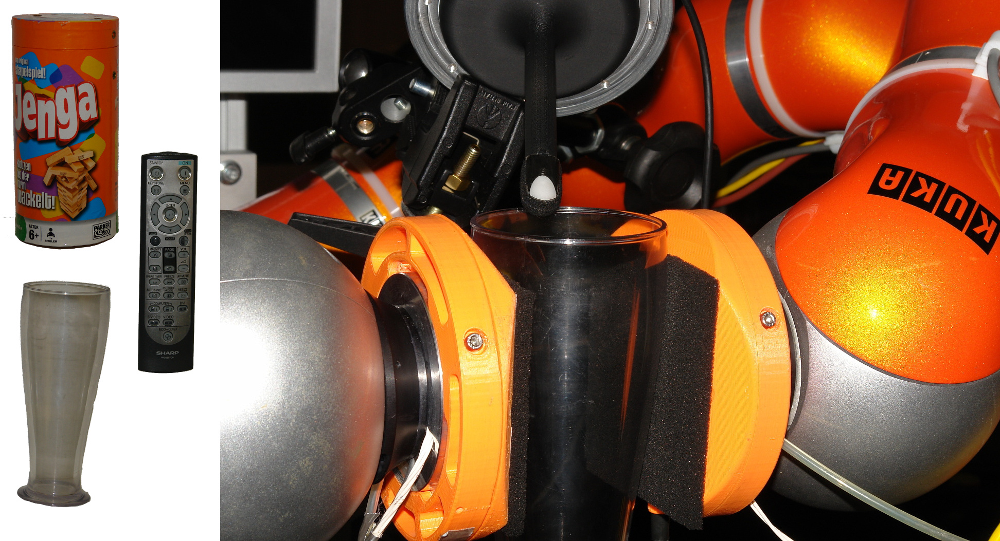

# NeuTouch summer school on Touch and Robotics

Tutorial: Slip Detection with Neural Networks

In this tutorial, we will look into incipient slip detection with deep neural networks. We will experiment with and evaluate various neural network architectures to detect and classify slippage.
To this end, we will work on a pre-recorded data set from our 16x16 tactile sensors arrays, comprising tactile time series data for three different situations:

- stable grasp condition
- translational slip
- rotational slip

For recording, we mounted two of the tactile sensor arrays as large fingertips onto Kuka LWR4 robot arms (the sensor boards are embedded into the orange cylindrical mounts and covered with black piezo-resistive foam).
An object held between the sensors starts slipping when the robot arms slowly release the grasp.
A tactile fingertip automatically registers when the object slipped away.

As the training of deep neural networks requires a lot of (parallel) computational resources, we prepared a [python notebook](https://colab.research.google.com/github/ubi-agni/summerschool-slip-detection/blob/master/tutorial.ipynb) on [Google Colab](https://colab.research.google.com/notebooks/intro.ipynb), which provides GPU support and a working [TensorFlow](https://www.tensorflow.org/install) environment.

**Please use this notebook** (you will need a Google account to do so):

https://colab.research.google.com/github/ubi-agni/summerschool-slip-detection/blob/master/tutorial.ipynb.

**Save the notebook** once to your Google Drive to keep any changes in case the Colab session times out.

Of course, if you have a working TensorFlow environment on your local machine, you can use the notebook directly as well. Just download the [notebook file](https://github.com/ubi-agni/summerschool-slip-detection/blob/master/tutorial.ipynb) (or clone this git repo) and start the notebook from your local browser or using e.g. [VS code](https://code.visualstudio.com/docs/datascience/jupyter-notebooks):

`python3 -m notebook`
